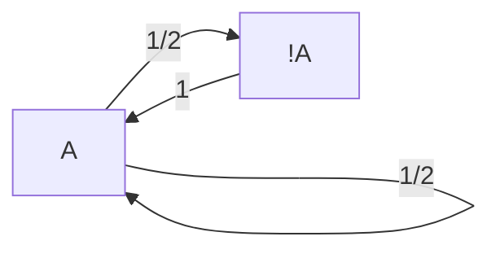

#《原神》祈愿机制概率研究

【摘要】本文以概率论、随机过程理论等工具研究游戏《原神》中的祈愿机制，主要基于动态规划，以“期望”和“概率的概率”两大分析方向进行数据处理，并根据分析结果总结了一些方便玩家规划金钱与资源的建议。由于追求多次获得五星道具的玩家基本“不差钱”，本文附有获取少量五星情况下的数据可视化。

[TOC]

> Version:20220105
>
> - 修了讲一遍时找到的笔误

## 规则表述

旅行者（玩家）可以通过祈愿机制获取“五星角色”“五星武器“”四星角色“”四星武器“来提高战斗力。其中，角色具有命之座机制，首次获得为0命，最高6命，命座数越高，角色越强；类似地，武器拥有精炼层数机制，首次获得为1阶，最高5阶。

最近的版本更新中，《原神》的祈愿机制也发生了一定的变化。

以下是《原神》两个祈愿机制的官方描述（https://ys.mihoyo.com/main/news/public）：

### 角色祈愿

**五星角色祈愿的基础概率为0.600%，综合概率（含保底）为1.600%**，最多90次祈愿必定能通过保底获取5星角色。

当祈愿获取到5星角色时，有50.000%的概率为本期5星UP角色「A1」*（小保底）*。如果本次祈愿获取的5星角色非本期5星UP角色，下次祈愿获取的5星角色必定为本期5星UP角色*（大保底）*。

**4星物品祈愿的基础概率为5.100%，4星角色祈愿的基础概率为2.550%，4星武器祈愿的基础概率为2.550%，4星物品祈愿的综合概率（含保底）为13.000%。**最多10次祈愿必定能通过保底获取4星或以上物品，通过保底获取4星物品的概率为99.400%，获取5星物品的概率为0.600%。

当祈愿获取到4星物品时，有50.000%的概率为本期4星UP角色「B」、「C」、「D」中的一个。如果本次祈愿获取的4星物品非本期4星UP角色，下次祈愿获取的4星物品必定为本期4星UP角色。当祈愿获取到4星UP物品时，每个本期4星UP角色的获取概率均等。

角色祈愿包括「角色活动祈愿-1」和「角色活动祈愿-2」，祈愿次数和保底完全共享，共同累计。二者区别仅在于当期UP的五星角色不同。

### 武器祈愿

**武器祈愿中，5星武器祈愿的基础概率为0.700%，综合概率（含保底）为1.850%，**最多80次祈愿必定能通过保底获取5星武器。

当祈愿获取到5星武器时，有75.000%的概率为本期5星UP武器「M」、「N」中的一个。如果本次祈愿获取的5星武器非本期5星UP武器，下次祈愿获取的5星武器必定为本期5星UP武器。

【定轨机制】命定值：玩家可以指定一把本期5星UP武器（定轨）。当获取到的5星武器为非当前定轨武器时，获得1点命定值，命定值达到满值2后，在本祈愿中获得的下一把5星武器必定为当前定轨武器。获取到当前定轨武器时，无论当前命定值是否达到满值，都将会重置为0，重新累计。在未通过命定值达到满值获取定轨武器的情况下，当祈愿获取到5星UP物品时，每把本期5星UP武器的获取概率均等。

未使用「神铸定轨」定轨武器时，将不会累积命定值。

**4星物品祈愿的基础概率为6.000%，4星角色祈愿的基础概率为3.000%，4星武器祈愿的基础概率为3.000%，4星物品祈愿的综合概率（含保底）为14.500%。**最多10次祈愿必定能通过保底获取4星或以上物品，通过保底获取4星物品的概率为99.300%，获取5星物品的概率为0.700%。

当祈愿获取到4星物品时，有75.000%的概率为本期4星UP武器「F」、「G」、「H」、「J」、「K」中的一个。如果本次祈愿获取的4星物品非本期4星UP武器，下次祈愿获取的4星物品必定为本期4星UP武器。当祈愿获取到4星UP物品时，每把本期4星UP武器的获取概率均等。

# 角色祈愿分析

## 五星角色概率建模

   前面的作业中，笔者通过运行代码和期望分析，对角色祈愿的机制进行了尝试1的模拟，简单回顾如下：

### 尝试1：89次伯努利实验

建模1：前89次祈愿，每次获得五星角色的概率均为0.6%，若前89次实验没有获得五星角色，则获取五星角色的概率为100%。

则可以建模二项分布概率密度：

$$ PDF(X = k) = (1-p)^{k-1}p(p = 0.6 \%)$$

$$ CDF(X = k) = (1 - p)^k$$

计算每次获取五星角色的祈愿数期望：

$$ E(X) = 90(1-CDF(89)) + \sum_{i=1}^{89}iPDF(x=i)$$

得到综合概率：

$$P = \frac{1}{E(X)} $$

结果为：1.435%。（详见week9作业）

与官方描述不符。实际上，官方提到的0.6%是基础概率，说明不是恒定概率的伯努利实验，于是提出模型2.

### 尝试2：概率递增的保底机制

建模2：在一定抽数都没有得到五星角色后，获得五星角色概率开始线性上升，直到第90抽达到100%。 

由于具体概率密度没有官方文档，只能站在前人的分析上，根据结合数据统计的开源项目（https://github.com/OneBST/GGanalysis，本文实际上相当于模型的复现）采用的模型，第x次祈愿获得五星角色的概率如下：

$$ P(x) = \begin{cases} 0.6\% &{x<=73}\\ 0.6\% + 6\%(x - 73) &{74<=x<=89}\\1&{x = 90} \end{cases}$$

由此，可以得到第x次祈愿得到五星角色的分布列（类似于几何分布）：

$$ PDF(x) = P(x) * \prod_{k = 1}^{x - 1}1-P(x) $$

$$ PDF(x) = \begin{cases} (1 - 0.6\%)^{x-1}\times0.6\% &{x\leqslant73}\\ (1-0.6\%)^{73} \times \sum_{k = 74}^{x} (1- 6\%(k - 73))^{k-73}(6\%(k-73)) &{74\leqslant x\leqslant89}\\(1-0.6\%)^{73} \times \sum_{k = 74}^{89} (1- 6\%(k - 73))^{k-73}&{x = 90} \end{cases} $$

**该模型平均获取五星角色的祈愿次数为62.3。**该模型下五星角色的综合概率为1.605%。

注：期望计算公式：

$$ E(X) = \sum_{i=1}^{x}PDF(x)\times x $$

## 概率递增保底机制下的数字特征

### 求数据特征

在这里处理一个认识误区：期望 != 概率为50%的点（中分位点）。

也就是说，期望作为概率的平均值，$ CDF(EX) = 0.5 $ **是不成立的**。 注意到这一前提，才能比较正确地理解下面的结论。

由于其概率密度并不是均匀分布的，差别较大，选择平均数似乎不太合适。所以我们获取中分位点。根本不应该是程序员能写出来的粗糙代码验证：

```python
import numpy as np
import matplotlib as mlp
import matplotlib.pyplot as plt
from matplotlib.pyplot import MultipleLocator
def p_5(n):
    if n < 73:
        return 0.006
    elif n < 89:
        return 0.006 + (n - 72) * 0.06
    else:
        return 1
    
pdf_5 = [];
cdf_5 = [];
tmp = 0.0;

for i in range (0,90):
    tmp = p_5(i);
    for j in range(0,i):
        tmp = tmp * (1 - p_5(j))
    pdf_5.append(tmp);
#注：下文中其他代码可能要用到p_5,p_4函数,pdf_5列表哦

for i in range (0,90):
    tmp = 0.0;
    for j in range (0,i+1):
        tmp = tmp + pdf_5[j];
    cdf_5.append(tmp);
    print(i+1,cdf_5[i])
# out:
#75 0.4739047630777248
#76 0.571758477145268
```

该模型的概率密度函数（蓝线）和分布函数（黄线）图：


我们不妨乐观一点，中分位点：75.

注：最概然祈愿次数为77。也就是说，在第77次祈愿获取五星角色的概率最高。

每次获得五星角色，需要的祈愿次数记为$N$. 则：

- 从期望角度考虑，N = 62.3.
- 从中分位点角度考虑，N = 75.

实际理解为：需要75次祈愿，才能使获得5星角色的发生概率达到50%（实际：46.8%）。

这种分布具有较强的右偏性。上面分析过，这两个数字特征具有不同的分析意义，可以理解为：

+ 祈愿623次，期望获得10个五星角色。（期望值）
+ 祈愿75次，能使获得五星角色的概率达到50%。

### 由期望特征进行资源规划

回到规则中，解决以下问题：

#### 获得五星角色A的期望次数分析

对于期望分析：注意到，对于获取当期UP五星角色，最多需要2次获得五星角色。也就是说，有50%的概率，仅需要获取一次五星角色；有50%的概率，需要获取2次五星角色。也就是说，需要获得五星角色的次数：

$$ 1 \times 50\% + 2 \times 50\%  = 1.5 $$

对于“获取五星角色”而言，多次获取（不论是否为当期UP角色）之间互相独立，因此需要的祈愿次数为$1.5 \times 62.3 = 93.45$ 次。

#### 获得6命座A角色的期望次数分析

注意到，对于“获取五星角色”而言，多次获取（不论是否为当期UP角色）之间互相独立。考虑这个问题：对于“获取A角色”事件之间，是相互独立的吗？

从期望角度考虑，可以说：是的。参考上面的思路，只需要“获取A角色”发生7次即可。因此需要的祈愿次数为 $1.5N \times 7 = 10.5N$ 也就是 654.15 次。

#### 获得四星角色B的期望次数分析

由于涉及“基础概率”，我们沿用上一开源项目模型的概率递增保底机制结论：

- 从第9次祈愿处开始上升。

- 获得五星角色并不会重置四星保底。

第x次祈愿获得四星角色的概率如下：

$$ P(x) = \begin{cases} 5.1\% & {x\leqslant8}\\ 56.1\% &{x = 9}\\1&{x = 10} \end{cases}$$

$$ PDF(x) = P(x) * \prod_{k = 1}^{x - 1}1-P(x)  = \begin{cases} (1 - 5.1\%)^{x-1}\times5.1\% & {x\leqslant8}\\ (1-5.1\%)^8\times56.1\% &{x=9}\\(1-5.1\%)^8\times43.9\%&{x = 10} \end{cases}$$ 

期望值：

$$ E(X) = \sum_{i=1}^{x}PDF(x)\times x = 7.66$$ 

综合概率：13.05%.

对于期望分析：注意到，对于获取当期UP五星角色，仅有$\frac{1}{3}$的概率得到当期UP的四星角色中的B，且每次获得当期四星角色时，有50%的概率，仅需要获取一次四星角色；有50%的概率，需要获取2次四星角色。也就是说，获得角色B的次数期望为$1.5 \times 3 \times E(X) = 34.5$ 。

### 由分位点特征进行分析

从“概率的概率”角度分析便没有期望分析那么简单了。中位点与期望的乘积并不能得到叠加事件的中位点。基本上大部分分而治之的想法均不满足独立性要求。我们需要寻找更一般的数学模型：

#### 获得多次五星角色的分位点分析

接下来，由于**使获得两次五星角色的概率达到50%的祈愿次数不等于获得一次五星角色祈愿次数的中位点的2倍**，我们需要计算分布的**叠加**。

我们从简单问题入手（自己编的）：

(1) 一直抛硬币，直到总共出现2次正面朝上，求期望的抛硬币次数——显然是4.

(2) 需要抛多少次硬币，使【至少出现2次正面朝上】的概率达到50%。

(3) 需要抛多少次骰子，使【至少出现2次点数1】的概率达到50%。

题目（2）（3）这类问题，可以转化成“几何分布的叠加问题”。这里的概率稳定~~比较简单~~，还可以参阅负二项分布有关资料。

而对于的祈愿的建模，概率不稳定，有三种可能的思考方向：一可以用模拟动态规划处理，二是对各种情况进行全概率公式展开（~~工作量极大~~），三是离散信号的进行卷积运算:$P(Z=X+Y=z) = \sum_1^\infty PDF(X=z-y)P(X=y)$

笔者采用第三种方法。

各位修改一下代码的变量，即可获取想要的值。

```python
c5_need = 2#需要抽出几次五星角色；
c5_poss = 0.25#想知道的概率;
conv = pdf_5;
for cnt in range(0,c5_need - 1):
    conv=np.convolve(conv,pdf_5,'full')
    plt.plot(conv)
    tmp = 0.0
    for i in range (0,len(conv)):
        tmp += conv[i]
        if(cnt == c5_need - 2 and tmp >= c5_poss):
            print(i+c5_need);
            break
    #DEMO
    #135 -- 需要祈愿135次，才有50%的概率获得两个五星角色。
	#祈愿154次，有75%的概率获得两个五星角色。
```

我对获得两次的情况列了个分布图：


#### 双角色池祈愿

这个其实没什么太大的变化，把A2等价成A1，就可以和上文的A的结论统一了。

## 保底依赖下的分位点分析

### 尝试1：将“保底获得的五星”和“祈愿次数”拆成两个独立事件

#### 保底之间的马尔可夫过程

由于角色祈愿机制满足：本次获取五星角色是否为A的概率仅取决于上次获取的五星角色是否为A。符合马尔可夫过程（状态$i$只取决于上一次状态$i-1$，与再先前的状态相互独立。参：课本P321）的建模标准，可以做出以下状态图和概率转移矩阵：


$$ M = \space \begin{matrix}  & A & !A\\A & {1}\over{2} & {1}\over{2}\\!A & 1 & 0\end{matrix}$$

马尔可夫链在三门问题、经济学分析、自然语言处理等领域具有广泛的应用，在极值环境下具有平稳分布的特点。以下进行模拟分析。

收敛的综合概率：$M^\infty$。经过计算，可知A物品的综合概率为$\frac{2}{3}$ 。这个计算结果可以理解为：任意一次获得五星角色，有$\frac{2}{3}$的概率是A.（初始状况：刚获得A，以说明存在小保底）

而对于中间情况的分析，可对应转换为矩阵的乘法和加法运算。

但是我们很难把两个独立事件的概率组合到一起，以达到50%，请看下面的分析。

#### 分类讨论的方式求取概率

我们以抽到零命为例，对应的状态矩阵为$M$。因为初始状态（你可以理解为-1命）为A，此时可以理解为对应的概率为：$p_{11}P(获得一次五星) +p_{12}(获得二次五星)$，其中获得两次五星的概率模型可参考上面的卷积公式（由于二次五星也比较简单，大可自己分类讨论写）,如：

$$ \frac{1}{2}PDF(X) + \frac{1}{2}PDF(Z)$$（注：x>90的部分，记为0即可，因为那部分情况已结束。）

验证这一方法的正确性：

```python
tmp = 0.0
for i in range(0,179):
    if(i<90): tmp += 0.5 * pdf_5[i];
    tmp+=0.5*conv[i];
    if(tmp>=0.5):
        print(i);
        break;
//沿用上方的数组了，输出为79.
因为列表下标是从0开始计数的，79 < 90 ，所以对应：80次祈愿可使抽到UP五星的概率达到50%。
```

如果需要制图，可以使用以下的画图模板代码

```python
#制图代码
x_major_locator=MultipleLocator(4)#x分度值设置
y_major_locator=MultipleLocator(0.1)
ax=plt.gca()
ax.xaxis.set_major_locator(x_major_locator)
ax.yaxis.set_major_locator(y_major_locator)
plt.grid()  # 生成网格
x_values = [x for x in range(1, 91)]
y_values = [pdf_5[x] for x in range(0, 90)]
plt.plot(x_values,y_values)
```

如果是多命，则需要更复杂的分类讨论。如：一命的情况，就需要二次转移矩阵$M^2$的各项作为转移概率了，包括(A A ， A !A A ， !A A A ， !A A !A A)四种状态对应的状态转移概率，以及多次的卷积结果。由于前面代码没有记忆，就不尝试了。

### 尝试2：动态规划的角度

#### 抽到多个五星角色中UP五星角色的个数概率

其实上面的转移矩阵比较简单，直接可以写出状态转移方程，考虑动态规划。

定义状态$dp[i][j][1]$表示第 $i$ 次获得的五星角色时得到当期UP角色A后，共获得了$j$次A角色，达到$j-1$命 （第一次获得A角色达到0命）；类似地，$dp[i][j][0]$ 表示第 $i$ 次获得的五星角色不是A。

则状态转移方程：

$$ dp[i][j][0] = \frac{1}{2}dp[i-1][j][1] $$

$$ dp[i][j][1] = \frac{1}{2}dp[i-1][j-1][1] + dp[i-1][j-1][0]$$

起点：$dp[0][0][1] = 1$

由此可以记$dp[i][j]$为第$i$次获得五星角色后共获得$j$次（及以上）A角色的概率，则：

$$ dp[i][j] = \sum_{k=j}^{i}dp[i][k][1]+dp[i][k][0] $$


尝试构造含$i,j,dp[i][j]$三个变量的图：

由图中可以估计获取1~7次A角色时，使概率达到50%时，横坐标即为需要获得A角色的次数。（x，y）表示，已获得x次五星角色的情况下，y为对应的总共获取次数大于等于对应i的概率。

#### 求取命座-祈愿次数概率

定义：$ dp[i][j][k] $ ：第j次祈愿的结果对应k，并第i次获得A角色的概率，则状态转移方程：

- 大保底状态：上次五星!A，这次必获得A；
- 小保底状态：上次五星是A（初始状态），这次只有50%的概率获得A。
- k = 0 ： 获得五星角色A
- k = 1 ： 获得五星角色且!A

（临时变量：tmp：上次获得五星的祈愿次数）

- 注意：要明确状态转移的结果“from to”。循环遍历时，由j逐步+k确定后续值并进行迭代赋值，会导致一个点的值多次计入概率，所以最后取概率只需要取[0]

$$ dp[i][j][0] = dp[i-1][tmp][1] * PDF(j-tmp) + dp[i-1][tmp][0] * \frac{1}{2} * PDF(j-tmp)$$

$$ dp[i][j][1] = dp[i][tmp][0] * \frac{1}{2} * PDF(j-tmp)$$

```python
n5_cnt=1;#要抽出多少次A
n5_tries=180;#准备的祈愿次数
tmp = 0;
dp_p = np.zeros((13, 180*n5_cnt+90,2), dtype=float);
dp_p[0][0][0] = 1
for i in range (0,n5_cnt+1):
        for j in range (0,n5_tries):
            for k in range (1,91):
                if(i-1>=0):
                    dp_p[i][j+k][0] += dp_p[i-1][j][1] * pdf_5[k-1] + dp_p[i-1][j][0] * 0.5 * pdf_5[k-1];
                dp_p[i][j+k][1] += dp_p[i][j][0] * 0.5 * pdf_5[k-1]
poss=[]
for i in range(0,n5_tries):
    tmp = tmp + dp_p[n5_cnt][i][0]
    poss.append(tmp)
print(tmp)
plt.plot(poss)
#DEMO:0.4762677010731945
```

 与上面的卷积验证是一致的。

0命概率图：

#### 非默认状态开始的动态规划（To Be Continued…）

如果开始状态为大保底状态，或已经有一定的祈愿次数呢？以后再写。

## 四星角色祈愿分析

预设：获取到五星时，不会重置四星角色的保底。且，以下策略，如果出了五星角色，先笑一笑，算法就当没祈愿哈~

### 概览

四星的分析只需要将上面的p_5相关改成p_4即可，在此省略不表，给出一定结论：

0命图：

### 算法

定义：$ dp[i][j][k] $ ：第j次祈愿的结果对应k，并第i次获得B角色的概率，则状态转移方程：

- 保底状态：上次四星!UP，这次必获得UP角色
- k = 0 ： 获得想要的四星角色B
- k = 1 ： 获得UP四星角色但不是B
- k = 2：获得非UP四星角色

（临时变量：tmp：上次获得四星的祈愿次数）

$$ dp[i][j][0] = dp[i-1][tmp][1] * PDF(j-tmp) * \frac{1}{6} \\+ dp[i-1][tmp][0] * \frac{1}{6} * PDF(j-tmp) \\+ dp[i-1][tmp][1] * PDF(j-tmp) * \frac{1}{3}$$

$$ dp[i][j][1] = dp[i][tmp][0] * \frac{1}{3} * PDF(j-tmp) \\+ dp[i][tmp][1] * PDF(j-tmp) * \frac{1}{3} \\+  dp[i][tmp][2] * \frac{2}{3} * PDF(j-tmp)$$

$$ dp[i][j][2] = dp[i][tmp][0] * \frac{1}{2} * PDF(j-tmp) + dp[i][tmp][1] * \frac{1}{2} * PDF(j-tmp)$$

任意代码：（原理与下方“无定轨机制武器祈愿”类似，这里人比较懒，直接对p_5移花接木了）

```python
#每抽概率
#这是研究四星的，但是为了偷懒，捏：
def p_5(n):
    if n < 8:
        return 0.051;
    elif n < 9:
        return 0.561;
    else:
        return 1;
        
pdf_5 = [];
cdf_5 = [];
tmp = 0.0;

for i in range (0,10):
    tmp = p_5(i);
    for j in range(0,i):
        tmp = tmp * (1 - p_5(j))
    pdf_5.append(tmp);

for i in range (0,10):
    tmp = 0.0;
    for j in range (0,i+1):
        tmp = tmp + pdf_5[j];
    cdf_5.append(tmp);
    print(i+1,cdf_5[i])
 
n5_cnt=1#要抽出多少次B
n5_tries=130 * n5_cnt;#准备的祈愿次数
tmp = 0;
dp_p = np.zeros((13, 150*n5_cnt + 20,3), dtype=float);
dp_p[0][0][0] = 1
# 0 - B 1 - UP & !B 2- !UP
for i in range (0,n5_cnt+1):
        for j in range (0,n5_tries):
            for k in range (1,11):
                if(i-1>=0):
                    dp_p[i][j+k][0] += dp_p[i-1][j][2] * pdf_5[k-1] * 1/3\
                                    + dp_p[i-1][j][1] * pdf_5[k-1] * 1/6 + dp_p[i-1][j][0] * 1/6 * pdf_5[k-1];
                dp_p[i][j+k][1] += dp_p[i][j][0] * 1/3 * pdf_5[k-1] + dp_p[i][j][2] * 2/3 * pdf_5[k-1]\
                                + dp_p[i][j][1] * 1/3 * pdf_5[k-1];
                dp_p[i][j+k][2] += dp_p[i][j][0] * 1/2 * pdf_5[k-1] + dp_p[i][j][1] * 1/2 * pdf_5[k-1];
poss=[]
for i in range(0,n5_tries):
    tmp = tmp + dp_p[n5_cnt][i][0]
    poss.append(tmp)
print(tmp)
#制图代码，直接cv用
x_major_locator=MultipleLocator(10)#x分度值设置
y_major_locator=MultipleLocator(0.1)
ax=plt.gca()
ax.xaxis.set_major_locator(x_major_locator)
ax.yaxis.set_major_locator(y_major_locator)
x_values = [x for x in range(1, n5_tries)]
plt.grid()  # 生成网格
plt.plot(poss)  
```


## 不同模型对比研究

### 与无保底机制（均匀1.6%）的对比

​	修改

```
def p_5(n):
	return 0.016;
```

期望：不变；

分位点图：

极端情况上升了~

两次五星分布图：


一命概率分布图：

可以发现，均匀和非均匀，有利有弊吧。

### 与保底前均匀机制（魔改尝试1）的对比

用我比较熟悉的c++建模以下（其实更精确的值为0.88%）

$$  P(x) = \begin{cases} 0.9\% &{x\leqslant 89}\\1&{x = 90} \end{cases} $$

期望：62.06（综合概率：1.61%）

分位点分布图：


两次五星分布图：

一命概率分布图：

会让更多人吃保底~

# 武器祈愿分析

## 概率递增保底机制及数字特征

武器祈愿的机制和角色祈愿大体一致。算法参上，在此直接给出结论。

五星武器概率：

$$P(x) = \begin{cases}0.7\% & x\leqslant62\\0.7\%+7\%(x-62) & 63\leqslant x \leqslant 71\\ 63.7\% + 3.5\%(x-71) & 72\leqslant x \leqslant 79 \\ 1 & x=80\end{cases}$$ 

数学期望：54.25.

综合概率：1.88%

分布图：


四星武器概率

$$P(x) = \begin{cases}6\% & x\leqslant 7\\66\% & x = 8 \\ 96\% & x = 9 \\ 1 & x=10\end{cases}$$

数学期望：6.74.

综合概率：14.84%。

你会发现，分成了四段，复杂了一点。

```python
#每抽概率
def p_5(n):
    if n < 62:
        return 0.007;
    elif n < 71:
        return 0.007 + (n - 62) * 0.07;
    elif n < 79:
        return 0.637 + (n - 71) * 0.035;
    else:
        return 1.0;
def p_4(n):
    if n < 7:
        return 0.06
    elif n < 8:
        return 0.66
    elif n < 9:
        return 0.96;
    else:
        return 1;
pdf_5 = [];#第x+1抽出概率
cdf_5 = [];
tmp = 0.0;

for i in range (0,80):
    tmp = p_5(i);
    for j in range(0,i):
        tmp = tmp * (1.0 - p_5(j))
    pdf_5.append(tmp);

for i in range (0,80):
    tmp = 0.0;
    for j in range (0,i+1):
        tmp = tmp + pdf_5[j];
    cdf_5.append(tmp);
    print(i+1,cdf_5[i])
```


## 定轨机制下的资源规划（假设定轨M）

### 获取五星武器M的祈愿次数分析

由于命定值机制，马尔可夫过程比较复杂。于是考虑动态规划：

定义$dp[i][j][k]$为第j次祈愿时第i次获得五星武器M，祈愿后k：

- k = 0 : 命定值为0。表示抽到了M.
- k = 1：命定值为1且抽到了N.
- k = 2：命定值为1且抽到的是非UP武器。
- k = 3：命定值为2，抽出来的不是M，具体是啥在本小节中不相关。

$$ dp[i][j][0] = dp[i-1][tmp][0] * \frac{3}{8} *PDF(j-tmp) \\+ dp[i-1][tmp][1] * \frac{3}{8} * PDF(j-tmp) \\+ dp[i-1][tmp][2] * \frac{1}{2}*PDF(j-tmp) \\+ dp[i-1][tmp][3] *PDF(j-tmp)$$

$$ dp[i][j][1] = dp[i][tmp][0] *\frac{1}{4}* PDF(j-tmp)$$

$$ dp[i][j][2] = dp[i][tmp][0] *\frac{3}{8}* PDF(j-tmp)$$

$$ dp[i][j][3] = dp[i][tmp][1] * ( \frac{3}{8} + \frac{1}{4}) *PDF(j-tmp) \\ + dp[i][tmp][2] * \frac{1}{2} * PDF(j-tmp)$$

运行代码：

```python
n5_cnt=2;#要抽出多少次M
n5_tries= 207;#准备的祈愿次数
tmp = 0;
dp_p = np.zeros((13, 330*n5_cnt,5), dtype=float);
dp_p[0][0][0] = 1
for i in range (0,n5_cnt+1):
        for j in range (0,n5_tries + n5_cnt + 1):
            for k in range (1,81):
                if(i-1>=0):
                    dp_p[i][j+k][0] += dp_p[i-1][j][0] * pdf_5[k-1] * 0.375\
                                + dp_p[i-1][j][1] * 0.375 * pdf_5[k-1] \
                                + dp_p[i-1][j][2] * 0.5 * pdf_5[k-1]\
                                + dp_p[i-1][j][3] * pdf_5[k-1];
                dp_p[i][j+k][1] += dp_p[i][j][0] * 0.25 * pdf_5[k-1];
                dp_p[i][j+k][2] += dp_p[i][j][0] * 0.375 * pdf_5[k-1];
                dp_p[i][j+k][3] += dp_p[i][j][1] * 0.625 * pdf_5[k-1]\
                                + dp_p[i][j][2] * 0.5 * pdf_5[k-1];
poss=[]
for i in range(0,n5_tries):
    tmp = tmp + dp_p[n5_cnt][i][0]
    poss.append(tmp)
print(tmp)
plt.plot(poss)
#0.49317051582855165
```

进行99次祈愿后，获得M的概率达到50%。以下是获取一次武器M的概率分布图：


### 获取五星武器N的祈愿次数分析

问题：我定轨了M，反而想获取五星武器N…（反向定轨）

定义$dp[i][j][k]$为第j次祈愿时第i次获得五星武器N，祈愿后k：

- k = 0 : 命定值为0。表示抽到了M.
- k = 1：命定值为1且抽到了N.
- k = 2：命定值为1且抽到的是非UP武器。
- k = 3：命定值为2，且抽到了N.
- k = 4：命定值为2，且抽到的是非UP武器。

$$ dp[i][j][0] = dp[i][tmp][0] * \frac{3}{8} *PDF(j-tmp) \\ + dp[i][tmp][1] * \frac{3}{8} * PDF(j-tmp) \\+ dp[i][tmp][2] * \frac{1}{2}*PDF(j-tmp) \\+ dp[i][tmp][3] * PDF(j-tmp) \\ + dp[i][tmp][4] * PDF(j-tmp)$$

$$ dp[i][j][1] = dp[i-1][tmp][0] *\frac{3}{8}* PDF(j-tmp)$$

$$ dp[i][j][2] = dp[i][tmp][0] *\frac{1}{4}* PDF(j-tmp)$$

$$ dp[i][j][3] = dp[i-1][tmp][1] * ( \frac{3}{8}) * PDF(j-tmp) \\ + dp[i-1][tmp][2] * \frac{1}{2} * PDF(j-tmp)$$

$$ dp[i][j][4] = dp[i][tmp][1] * \frac{1}{4} * PDF(j-tmp)$$

```python
n5_cnt=1;#要抽出多少次N
n5_tries= 106;#准备的祈愿次数
tmp = 0;
dp_p = np.zeros((13, 510*n5_cnt + 80,5), dtype=float);
dp_p[0][0][0] = 1
for i in range (0,n5_cnt+1):
        for j in range (0,n5_tries + n5_cnt + 1):
            for k in range (1,81):
                dp_p[i][j+k][0] += dp_p[i][j][0] * pdf_5[k-1] * 0.375\
                                + dp_p[i][j][1] * 0.375 * pdf_5[k-1] \
                                + dp_p[i][j][2] * 0.5 * pdf_5[k-1]\
                                + dp_p[i][j][3] * pdf_5[k-1]\
                                + dp_p[i][j][4] * pdf_5[k-1];
                dp_p[i][j+k][1] += dp_p[i-1][j][0] * 0.375 * pdf_5[k-1];
                dp_p[i][j+k][2] += dp_p[i][j][0] * 0.25 * pdf_5[k-1];
                dp_p[i][j+k][3] += dp_p[i-1][j][1] * 0.375 * pdf_5[k-1]\
                                + dp_p[i-1][j][2] * 0.5 * pdf_5[k-1];
                dp_p[i][j+k][4] += dp_p[i][j][1] * 0.25 * pdf_5[k-1]
poss=[]
for i in range(0,n5_tries):
    tmp = tmp + dp_p[n5_cnt][i][1] + dp_p[n5_cnt][i][3]
    poss.append(tmp)
print(tmp)
#DEMO:0.5007747697175682
```

图表

​    

### 获取五星武器M、N的祈愿次数分析（To Be Updated…)

问题：我定轨了M，但M、N都想要。

我可能比较蠢：四维动态规划？

定义$dp[h][i][j][k]$为第j次祈愿时第i次获得五星武器N，第h获得五星武器M，祈愿后k：……（同上）

呃，我们先不考虑土豪了哈，我们只考虑都只获得1次的情况，只需要把`tmp = tmp + dp_p[n5_cnt][i][1] + dp_p[n5_cnt][i][3]` 再加一项 `dp_p[n5_cnt][i][0]` ？

我也希望这能成功，但是这么直接地不可行，因为前面那两项的概率本身就包含了上一次抽到M的情况，再加会导致重复计算，我没想到别的方式改良之。

另一种思路是分类讨论了，分为先获得M后获得N、先获得N再获得M两种情况。

再者就是还是含泪：

- 需要做出一定的修改，使状态转移时，不忽略h的出现次数。

$$ dp[h][i][j][0] = dp[h-1][i][tmp][0] * \frac{3}{8} *PDF(j-tmp) \\ + dp[h-1][i][tmp][1] * \frac{3}{8} * PDF(j-tmp) \\+ dp[h-1][i][tmp][2] * \frac{1}{2}*PDF(j-tmp) \\+ dp[h-1][i][tmp][3] * PDF(j-tmp) \\ + dp[h-1][i][tmp][4] * PDF(j-tmp)$$

$$ dp[h][i][j][1] = dp[h][i-1][tmp][0] *\frac{3}{8}* PDF(j-tmp)$$

$$ dp[h][i][j][2] = dp[h][i][tmp][0] *\frac{1}{4}* PDF(j-tmp)$$

$$ dp[h][i][j][3] = dp[h][i-1][tmp][1] * ( \frac{3}{8}) * PDF(j-tmp) \\ + dp[h][i-1][tmp][2] * \frac{1}{2} * PDF(j-tmp)$$

$$ dp[h][i][j][4] = dp[h][i][tmp][1] * \frac{1}{4} * PDF(j-tmp)$$

事实证明上面的方法不一定获得了正确答案。这个错误是没有价值的吗，不，他可能会给一个同样想研究这一问题的人一个参考。于是提出下面的形式：

定义$dp[i][j][k]$为第j次祈愿时，i - 获得的目标种类数 , 祈愿后k同上。

其实关键原因和上面的“加一项”一样，就是因为最后获取概率时，需要涵盖多个状态。以前的动态规划获取概率时，获取的状态间互相不存在依赖，而这次获取概率时，各个状态内部的转移存在相关。

最近灵感较为枯竭，先赶别的ddl了。在此附上可能是错误的代码（若考虑较大次数，可能需修改码参数/概率不准确）和运行结果：

```python
n5_cnt_M=1;#要抽出多少次M,N
n5_cnt_N=1;
n5_cnt=n5_cnt_M + n5_cnt_N;
n5_tries= 180*n5_cnt;#准备的祈愿次数
tmp = 0;
dp_p = np.zeros((13,13, 310*n5_cnt + 80,5), dtype=float);
dp_p[0][0][0][0] = 1

h = 0;
for h in range (0,3*n5_cnt_M +1):
    for i in range(0,3*n5_cnt_N+1):
        for j in range (0,n5_tries + n5_cnt + 1):
            for k in range (1,81):
                    dp_p[h][i][j+k][0] += dp_p[h-1][i][j][0] * pdf_5[k-1] * 0.375\
                                + dp_p[h-1][i][j][1] * 0.375 * pdf_5[k-1] \
                                + dp_p[h-1][i][j][2] * 0.5 * pdf_5[k-1]\
                                + dp_p[h-1][i][j][3] * pdf_5[k-1]\
                                + dp_p[h-1][i][j][4] * pdf_5[k-1];
                    dp_p[h][i][j+k][1] += dp_p[h][i-1][j][0] * 0.375 * pdf_5[k-1];
                    dp_p[h][i][j+k][2] += dp_p[h][i][j][0] * 0.25 * pdf_5[k-1];
                    dp_p[h][i][j+k][3] += dp_p[h][i-1][j][1] * 0.375 * pdf_5[k-1]\
                                + dp_p[h][i-1][j][2] * 0.5 * pdf_5[k-1];
                    dp_p[h][i][j+k][4] += dp_p[h][i][j][1] * 0.25 * pdf_5[k-1]

poss=[]
for i in range(0,n5_tries):
    for i1 in range (n5_cnt_M,3*n5_cnt_M+1):
        tmp += dp_p[i1][n5_cnt_N][i][1] + dp_p[i1][n5_cnt_N][i][3]
    for i2 in range(n5_cnt_N,3*n5_cnt_N+1):
        tmp += dp_p[n5_cnt_M][i2][i][0];
    poss.append(tmp)
print(tmp)
#制图代码，直接cv用
x_major_locator=MultipleLocator(20)#x分度值设置
y_major_locator=MultipleLocator(0.1)
ax=plt.gca()
ax.xaxis.set_major_locator(x_major_locator)
ax.yaxis.set_major_locator(y_major_locator)
plt.grid()  # 生成网格
plt.plot(poss)
```


拓展问题：我先定轨了M，获取M后定轨N（命定值清零），参考上面两个问题叠加应该可以。

### 四星武器的分析

和上面四星角色祈愿分析思想一致。

```python
#偷懒：p_5的内容实际是p_4
n5_cnt=1#要抽出多少次F
n5_tries=130 * n5_cnt;#准备的祈愿次数
tmp = 0;
dp_p = np.zeros((13, 150*n5_cnt + 20,3), dtype=float);
dp_p[0][0][0] = 1
# 0 - F 1 - UP & !F 2- !UP
for i in range (0,n5_cnt+1):
        for j in range (0,n5_tries):
            for k in range (1,11):
                if(i-1>=0):
                    dp_p[i][j+k][0] += dp_p[i-1][j][2] * pdf_5[k-1] * 1/5\
                                    + dp_p[i-1][j][1] * pdf_5[k-1] * 3/20 + dp_p[i-1][j][0] * 3/20 * pdf_5[k-1];
                dp_p[i][j+k][1] += dp_p[i][j][0] * 3/5 * pdf_5[k-1] + dp_p[i][j][2] * 4/5 * pdf_5[k-1]\
                                + dp_p[i][j][1] * 3/5 * pdf_5[k-1];
                dp_p[i][j+k][2] += dp_p[i][j][0] * 1/4 * pdf_5[k-1] + dp_p[i][j][1] * 1/4 * pdf_5[k-1];
poss=[]
for i in range(0,n5_tries):
    tmp = tmp + dp_p[n5_cnt][i][0]
    poss.append(tmp)
print(tmp)
#制图代码，直接cv用
x_major_locator=MultipleLocator(10)#x分度值设置
y_major_locator=MultipleLocator(0.1)
ax=plt.gca()
ax.xaxis.set_major_locator(x_major_locator)
ax.yaxis.set_major_locator(y_major_locator)
x_values = [x for x in range(1, n5_tries)]
plt.grid()  # 生成网格
plt.plot(poss)  
```


## 无定轨机制下武器祈愿分析

和上面四星角色祈愿分析思想一致。

```python
#这次下面是真的武器池概率分布p_5了哈
n5_cnt=1#要抽出多少次M
n5_tries=240 * n5_cnt;#准备的祈愿次数
tmp = 0;
dp_p = np.zeros((13, 320*n5_cnt + 20,3), dtype=float);
dp_p[0][0][0] = 1
# 0 - M 1 - UP & !M 2- !UP
for i in range (0,n5_cnt+1):
        for j in range (0,n5_tries):
            for k in range (1,81):
                if(i-1>=0):
                    dp_p[i][j+k][0] += dp_p[i-1][j][2] * pdf_5[k-1] * 1/2 \
                                    + dp_p[i-1][j][1] * pdf_5[k-1] * 3/8 + dp_p[i-1][j][0] * 3/8 * pdf_5[k-1];
                dp_p[i][j+k][1] += dp_p[i][j][0] * 3/8 * pdf_5[k-1] + dp_p[i][j][2] * 1/2 * pdf_5[k-1]\
                                + dp_p[i][j][1] * 3/8 * pdf_5[k-1];
                dp_p[i][j+k][2] += dp_p[i][j][0] * 1/4 * pdf_5[k-1] + dp_p[i][j][1] * 1/4 * pdf_5[k-1];
poss=[]
for i in range(0,n5_tries):
    tmp = tmp + dp_p[n5_cnt][i][0]
    poss.append(tmp)
print(tmp)
#制图代码，直接cv用
x_major_locator=MultipleLocator(15)#x分度值设置
y_major_locator=MultipleLocator(0.1)
ax=plt.gca()
ax.xaxis.set_major_locator(x_major_locator)
ax.yaxis.set_major_locator(y_major_locator)
x_values = [x for x in range(1, n5_tries)]
plt.grid()  # 生成网格
plt.plot(poss)  
```

你如果和上面定轨时比较，会发现你想要M的话，需要投入稍微更多的抽数。而且可以看见，当投入200抽时，定轨机制下的获取M的概率已经逐步收敛至1。而不定轨机制下，获取到的概率的概率仅在80%附近，且之后收敛较慢，极端情况的发生概率并不低。

有关不定轨又同时想要M和N的，TBC…

# 总结

概率分析还可以分析：如何配置属性让伤害最大化等问题。概率论作为一种打破人的直觉的东西，实在是让人又爱又恨。本文不仅仅局限于传统的期望范畴，结合具体概率的分布分析了对应的抽数需求。由于祈愿机制的概率不是恒定的，期望与中分位点存在区别，可以用平均GDP和中位数来感受。

致谢：感谢张老师的帮助和OneBST的分享。

【To Be Continued】

- 同时研究多个四星的祈愿次数

- 常驻祈愿结合“联动规则”的分析

- 常驻祈愿与UP祈愿结合分析

- 蒙特卡罗模拟与大数定律

- 通过置信度研究极端情况


